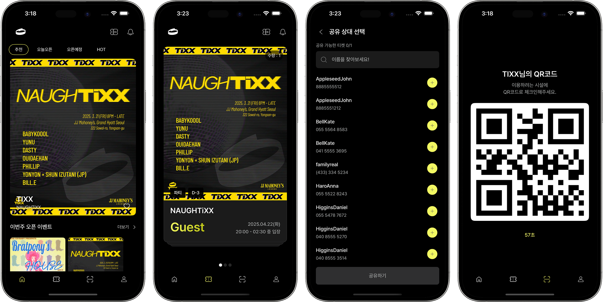

# TIXX

> ⚠️ 이 리포지토리는 TIXX의 모바일 앱 부분을 포트폴리오 용도로 재구성한 것입니다.

## 서비스 소개

TIXX는 클럽 파티 게스트 초대의 불편함에서 시작된 프로젝트로 클럽, 페스티벌, 파티, 팝업 행사 등 다양한 이벤트를 위한 예약 및 입장 관리 기능을 제공하는 모바일 애플리케이션입니다. 사용자에게 QR 코드 기반의 디지털 티켓을 발급하여 빠르고 효율적인 입장 절차를 지원하며, 이벤트 관련 정보를 포함한 다양한 부가 기능을 제공합니다.



## 배포 링크

- 앱
  - [Google Play](https://play.google.com/store/apps/details?id=com.tixx.mobile&pli=1)
  - [App Store](https://apps.apple.com/kr/app/tixx/id6737306169)
- 클라이언트용 웹
  - [TIXX](https://admin.tixx.site)

## 기술 스택

- React, React Native, TypeScript, TanStack Query, Zustand, Tailwind CSS

## 폴더 구조

```
tixx-apps/
├─ app/      # React Native 모바일 앱
├─ website/  # React 클라이언트용 웹
└─ README.md
```

## 핵심 기능

### 앱

[앱 상세보기](https://github.com/5unk3n/tixx-apps/blob/main/app/README.md)

- 이벤트/베뉴 탐색
- 티켓 보관·공유
- 알림
- 지도

### 클라이언트용 웹

[웹 상세보기](https://github.com/5unk3n/tixx-apps/blob/main/website/README.md)

- 이벤트/티켓/참가자 관리
- QR 스캔
- 채널(호스트) 설정
