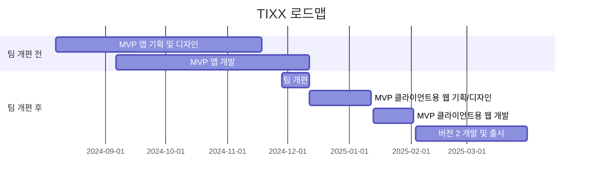

# TIXX

- [Google Play Store](https://play.google.com/store/apps/details?id=com.tixx.mobile&pli=1)
- [App Store](https://apps.apple.com/kr/app/tixx/id6737306169)

## 서비스 소개

TIXX는 클럽 파티 게스트 초대의 불편함에서 시작된 프로젝트로 클럽, 페스티벌, 파티, 팝업 행사 등 다양한 이벤트를 위한 예약 및 입장 관리 기능을 제공하는 모바일 애플리케이션입니다. 사용자에게 QR 코드 기반의 디지털 티켓을 발급하여 빠르고 효율적인 입장 절차를 지원하며, 이벤트 관련 정보를 포함한 다양한 부가 기능을 제공합니다.

### 로드맵



- **팀 개편 전** (기획 1, 디자이너 1, **프론트엔드 개발 1**, 백엔드 개발 1)
  - 11월 18일 - MVP 앱 디자인 완료
  - 12월 12일 - MVP 앱 개발 완료
- **팀 개편 후** (기획 2, 디자이너 2, **프론트엔드 개발 1**, 백엔드 개발 2)
  - 1월 12일 - MVP 클라이언트용 웹 기획 및 디자인 완료
  - 2월 2일 - MVP 클라이언트용 웹 개발 완료
  - 3월 - 버전 2 출시 (이벤트 탐색 기능 추가, UI 개선, 티켓 결제 기능 추가, 웨이팅 등록 기능 추가)

### 주요 기능

- 홈
  - 사용가능한 티켓을 날짜별로 그룹화해서 보여줌
  - 나의 QR코드 생성
- 마이 페이지
  - 내 티켓, 보낸 티켓, 받은 티켓을 보여줌
  - 내 티켓은 사용 가능, 사용 완료, 만료/취소로 필터링
- 이벤트
  - 이벤트 정보 확인
  - 이벤트의 위치를 정적, 동적 지도로 확인
- 티켓
  - 연락처 api를 사용해 친구에게 티켓 공유

## 사용 기술 스택


## 구현한 기능

- 애플, 카카오, 네이버 OAuth 구현
- reanimated와 gesture-handler를 활용한 복잡한 인터랙션의 캐러셀 구현
- FCM을 통한 실시간 푸시 알림 시스템 구축
- 캡쳐 방지를 적용해 QR코드의 보안성 향상
- SMS Retriever API 사용으로 안드로이드에서 회원가입 UX 향상
- 이벤트 장소를 네이버 지도의 static map 및 dynamic map에 표시
- Tailwind CSS, React Native Paper, React Navigation의 테마 통합

## 실행 방법

```bash
# 프로젝트 클론
git clone https://github.com/5unk3n/tixx-app.git

# 의존성 설치
cd app && yarn install

# ios 의존성 설치 (필요한 경우)
cd ios && pod install

# 앱 실행
yarn start
```

## 디렉토리 구조

```bash
src
 ┣ apis        # 기능별 API 요청 함수
 ┣ assets      # SVG, 폰트, 이미지 등 정적 에셋
 ┣ components
 ┃ ┣ features  # 특정 기능을 담당하는 UI 컴포넌트
 ┃ ┗ ui        # 공통적으로 사용되는 재사용 가능한 UI 컴포넌트
 ┣ constants   # 프로젝트 전역에서 사용되는 상수 값
 ┣ hooks
 ┃ ┣ queries   # TanStack Query 기반 쿼리 및 뮤테이션 커스텀 훅
 ┃ ┗ ...       # 기타 커스텀 훅
 ┣ navigation  # 네비게이션 구조와 관련된 로직과 컴포넌트
 ┣ screens     # 라우팅 구조 기반으로 화면을 구성하는 컴포넌트
 ┣ stores      # Zustand 전역 상태 관리 로직
 ┣ theme       # Tailwind CSS와 React Native Paper 등에서 사용되는 색상 및 폰트 테마 정의
 ┣ types       # 타입 정의
 ┣ utils       # 유틸리티 함수
 ┗ App.tsx     # 앱의 진입점
```
